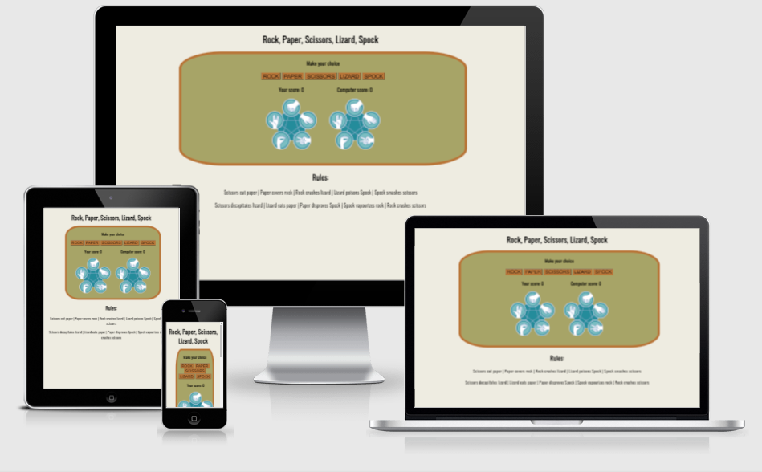
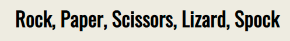
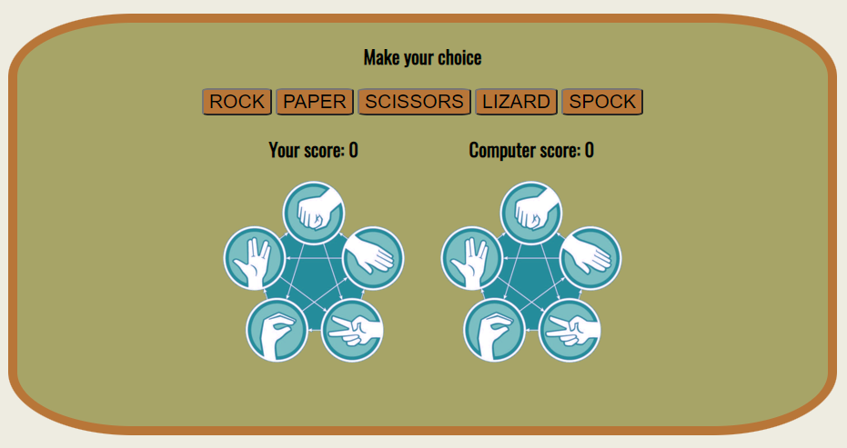
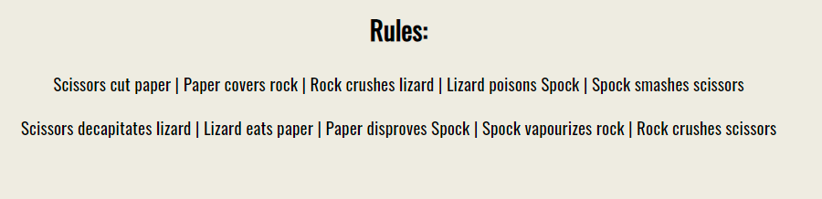
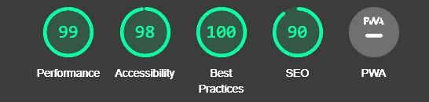

# Rock, Paper, Scissors, Lizard, Spock
Rock Paper Scissors Lizard Spock is an extension of the classic game of chance, Rock Paper Scissors, created by Sam Kass and Karen Bryla.
This site is targeted towards kids and adults, who want to:
- Learn the rules
- Practice
- Have fun playing.

 

## Features

### Header
 - Clearly tells user what kind of game this is.

 

### Game area
- Contains buttons with options for the user:
    - Rock
    - Paper
    - Scissors
    - Lizard
    - Spock
- Displays users and computer score
- Displays images of user and computer choices
- After every turn, displays message:
    - You won!
    - You lost!
    - Draw!



### Footer
- Displays game rules 



### Future implements 
- include functionality, that is based on sertain amount of hands, to determine winner, by comparing scores.

## Testing
- I tested that this webpage works in different browssers: Chrome, Firefox, Opera, Edge.
- I confirmed that this webpage is responsive and works on different screen sizes.
- I confirmed that all element are readable and easy to understand.
- I confirmed that colors and fonts chosen are easy to read and accessible by running it through lighthouse in devtools.



## Validator Testing

- HTML - No errors returned when passing through the official W3C validator
- CSS - No errors returned when passing through the official W3C (Jigsaw) validator

## Bugs

### Fixed bugs
- When I deployed project to GitHub Pages, I discovered, that start pictures and script were not loading.
- I discovered, that this happened because i used absolute file path in my code:

    ```<script src="/assets/js/script.js"></script>``` 

- Removing ```/``` in yhe start of the source fixed the problem.


## Deployment

- The site was deployed to GitHub pages
- [The live link can be found here](https://algirdas1993.github.io/rock_paper_scissors_lizard_spock/)

## Credits

  ### Content

- Used images were taken from [Icon Library](https://icon-library.com/)
- Used images were resized with [Resizepixel](https://www.resizepixel.com/)
